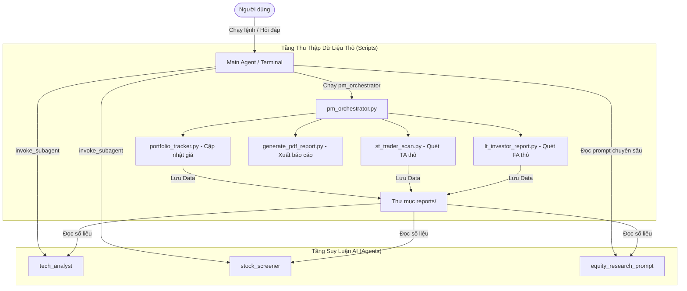

# Vietnam Multi-Agent Portfolio Plugin

Hệ thống quản lý danh mục đầu tư chứng khoán Việt Nam đa tác nhân (Multi-Agent System). Ứng dụng phương pháp đầu tư của William O'Neil (CANSLIM), Mark Minervini (VCP) và Warren Buffett (Value/Margin of Safety).

## Kiến Trúc Hệ Thống (Data-Driven Agentic Workflow)

Hệ thống được thiết kế theo mô hình **Tách biệt Dữ liệu và Suy luận**: Các tập lệnh (Scripts) chịu trách nhiệm cào dữ liệu nhanh gọn, trong khi các Tác nhân AI (Agents) đảm nhiệm việc suy luận sâu.

Quy trình chuẩn:
1. **Tiền xử lý (Pre-Fetch):** Bắt buộc chạy lệnh điều phối (`orchestrate`) trước tiên để hệ thống script tải dữ liệu tài chính thô, dữ liệu giá, và tính toán các chỉ báo cơ bản. Việc này mất vài giây và không tốn chi phí API LLM.
2. **Suy luận (Reasoning):** Dùng các Subagent hoặc Prompt nâng cao để đọc các báo cáo thô vừa tải về ở bước 1, từ đó đưa ra phân tích sâu và khuyến nghị mua/bán chi tiết.

## Cấu Trúc Thư Mục

Toàn bộ dữ liệu của hệ thống được quy hoạch chặt chẽ:
- `AGENTS.md`: Định nghĩa luật chơi cốt lõi và Workflow tiêu chuẩn cho hệ thống.
- `agents/`: Định nghĩa các subagent (stock_screener, tech_analyst, v.v.).
- `data/`: Nơi lưu trạng thái danh mục (`portfolio.json`) và watchlist.
- `reports/`: Nơi chứa các báo cáo thô (Markdown) và tổng hợp PDF.
- `scripts/`: Chứa các công cụ cào dữ liệu cốt lõi:
  - `vn_data_provider.py`: Bộ máy tải số liệu tài chính từ Vnstock.
  - `pm_orchestrator.py`: Nhạc trưởng điều phối quá trình cào dữ liệu.
  - `st_trader_scan.py` & `lt_investor_report.py`: Sinh dữ liệu thô phục vụ Agent.
- `skills/`: Khu vực chứa các kỹ năng chuyên môn (CANSLIM, VCP).
- `references/`: Chứa các bộ prompt chuyên gia như `equity_research_prompt.md`.

## Danh Sách Skills Chuyên Môn

Plugin cung cấp một tập hợp các skill chuyên sâu:
- `vietnam-stock-manager`: Script core của hệ thống để đồng bộ giá, hiển thị dashboard CLI, và tạo báo cáo định kỳ. Bao gồm hỗ trợ tạo báo cáo phân tích cơ bản (Equity Research) tự động qua luồng Multi-agent kết hợp dữ liệu tài chính từ API.
- `canslim-screener`: Quét cổ phiếu theo 7 tiêu chí CANSLIM.
- `vcp-screener`: Quét cổ phiếu theo mô hình thu hẹp biến động (VCP).
- `buffett-screener`: Bộ lọc Margin of Safety dựa trên FCF Yield, ROIC, P/E.
- `technical-analyst`: Đọc và phân tích biểu đồ giá kỹ thuật.
- `breakout-trade-planner` & `position-sizer`: Tư vấn kế hoạch giao dịch dựa trên rủi ro (Risk-based Position Sizing).

## Hướng Dẫn Cài Đặt (Thông qua Chatbot)

Việc cài đặt cực kỳ đơn giản. Bạn chỉ cần sao chép câu lệnh dưới đây và gửi cho tác nhân AI (Agent) của bạn:

*"Hãy tải và cài đặt plugin quản lý danh mục chứng khoán Việt Nam từ link Github này: https://github.com/nguyentranminhchien-ccpl/Vietnam-Stock-Portfolio-Management-Plugin"*

Agent sẽ tự động clone repo, thiết lập thư mục và tải các kỹ năng (skills).

## Hướng Dẫn Sử Dụng Nhanh

Bạn không cần phải nhớ lệnh cấu hình rườm rà. Chỉ cần trò chuyện với tôi:
- *"Cập nhật danh mục của tôi gồm ACB dài hạn 500 cổ giá 23000, SHS ngắn hạn 500 cổ giá 18000, watchlist SSI"*
  - *"Đánh giá kỹ thuật danh mục giúp tôi dựa trên dữ liệu vừa quét."*
  - *"Dùng equity_research_prompt để phân tích chuyên sâu mã ACB."*
  - *"Kiểm tra mức độ tập trung ngành của danh mục hiện tại."*

## Chào Mừng Người Dùng Mới (Onboarding Workflow)

Khi bạn lần đầu sử dụng plugin hoặc yêu cầu "khởi tạo danh mục", Agent sẽ tự động hỗ trợ bạn thực hiện các bước sau một cách trơn tru:
1. **Cài đặt tự động:** Agent sẽ tự động chạy lệnh cài đặt các thư viện Python cần thiết (`vnstock`, `rich`, `fpdf`, `pandas`).
2. **Cấu hình API:** Hỗ trợ thiết lập key API của `Mozyfin` (nếu bạn có), hoặc tự động cấu hình dùng `vnstock` miễn phí.
3. **Thiết lập danh mục:** Hỏi thông tin danh mục của bạn và tự động khởi tạo các file `portfolio.json` và `watchlist.json` chuẩn mực.
4. **Kích hoạt hệ thống:** Tự động quét toàn bộ mã chứng khoán bạn đang giữ và sinh báo cáo PDF đầu tiên để bạn đọc ngay lập tức.

---

## Nguồn Tham Khảo

Các file skill cốt lõi trong hệ thống được tham khảo và phát triển dựa trên nguồn [claude-trading-skills](https://github.com/tradermonty/claude-trading-skills).

## ⚠️ Tuyên Bố Miễn Trừ Trách Nhiệm (Disclaimer)

Hệ thống **Vietnam Multi-Agent Portfolio** và các Tác nhân AI (Agents) đi kèm chỉ đóng vai trò cung cấp công cụ tự động hóa thông tin và phân tích giả định dựa trên dữ liệu quá khứ.
- Các báo cáo và kết luận **KHÔNG** mang tính chất xúi giục, tư vấn đầu tư tài chính cá nhân, hay khuyến nghị Mua/Bán chính thức.
- Mọi quyết định giao dịch chứng khoán dựa trên đầu ra của hệ thống hoàn toàn thuộc trách nhiệm và rủi ro của người sử dụng.
- Tác giả và hệ thống AI sẽ không chịu bất kỳ trách nhiệm pháp lý nào đối với những khoản thua lỗ hoặc thiệt hại vật chất/tinh thần phát sinh từ việc sử dụng các thông tin này. Hãy luôn tự mình nghiên cứu kỹ lưỡng (Do Your Own Research) và quản trị rủi ro nghiêm ngặt.
