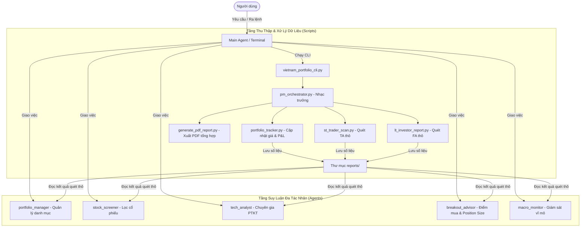

# Vietnam Multi-Agent Portfolio Plugin

Hệ thống quản lý danh mục đầu tư chứng khoán Việt Nam đa tác nhân (Multi-Agent System), hỗ trợ phân tích định lượng và định tính nâng cao dựa trên các phương pháp đầu tư kinh điển: **CANSLIM (William O'Neil)**, **VCP (Mark Minervini)** và **Margin of Safety (Warren Buffett)**.

Hệ thống tích hợp dữ liệu từ `mozyfin-cli` kết hợp cơ chế dự phòng tự động (Dual-Data Fallback) bằng thư viện `vnstock` v4, đảm bảo việc truy xuất báo cáo tài chính và dữ liệu giá hoàn toàn miễn phí khi tài khoản chính hết lượt truy vấn.

---

## 1. Kiến Trúc Hệ Thống (Data-Driven Agentic Workflow)

Hệ thống tuân thủ triết lý **Tách biệt Dữ liệu (Scripts) và Suy luận (Agents)**: các tập lệnh Python tối ưu hóa để cào và tiền xử lý dữ liệu nhanh chóng, trong khi các Agent AI chịu trách nhiệm phân tích sâu và đề xuất kế hoạch hành động.



### Quy trình phân tích chuẩn:
1. **Tiền xử lý (Pre-Fetch):** Bắt buộc chạy lệnh điều phối dữ liệu (`orchestrate`) để các script tự động tải dữ liệu tài chính, tính toán SMA/RSI/MACD/VCP/CANSLIM thô và xuất kết quả vào thư mục `reports/`. Bước này chỉ mất vài giây và không tiêu tốn API key của LLM.
2. **Suy luận (AI Reasoning):** Gọi các tác nhân AI phù hợp đọc hiểu dữ liệu thô vừa tải để cung cấp phân tích sâu sắc, biểu đồ kỹ thuật và đề xuất phân bổ vốn.

---

## 2. Cấu Trúc Thư Mục Plugin

```text
vietnam-multiagent-portfolio/
├── .agents/              # Log chạy và metadata của Agents (không push git)
├── agents/               # File cấu hình các Agent (stock_screener, tech_analyst,...)
├── data/                 # Cơ sở dữ liệu danh mục của người dùng
│   ├── market_config.json # Tham số vĩ mô và lãi suất phi rủi ro
│   ├── portfolio.json     # Trạng thái danh mục hiện tại
│   ├── transactions.json  # Nhật ký mua/bán cổ phiếu
│   └── watchlist.json     # Danh sách theo dõi chi tiết
├── reports/              # Thư mục chứa báo cáo Markdown/PDF (không push git ngoại trừ .gitkeep)
├── scripts/              # Các tập lệnh xử lý dữ liệu lõi
│   ├── vn_data_provider.py # Bộ máy cung cấp dữ liệu (Mozyfin + Vnstock Fallback)
│   ├── pm_orchestrator.py  # Điều phối quy trình cập nhật dữ liệu tự động
│   ├── portfolio_tracker.py # Cập nhật giá, tính toán P&L danh mục
│   ├── st_trader_scan.py   # Quét bộ chỉ báo kỹ thuật ngắn hạn (SMA, RSI, MACD)
│   ├── lt_investor_report.py # Sinh báo cáo tài chính dài hạn cơ bản
│   ├── generate_pdf_report.py # Biên soạn và xuất báo cáo PDF tiếng Việt chuyên nghiệp
│   └── update_portfolio.py # Xử lý giao dịch mua/bán và tính lại giá vốn bình quân
├── skills/               # Định nghĩa các skill chuyên môn (VCP, CANSLIM, Position Sizer)
└── references/           # Bộ tài liệu hướng dẫn và prompt chuyên sâu
```

---

## 3. Hướng Dẫn Sử Dụng Nhanh

### Qua giao diện dòng lệnh (CLI Wrapper)
Plugin cung cấp công cụ điều phối `vietnam_portfolio_cli.py` để thao tác nhanh từ terminal:

*   **Xem bảng P&L danh mục (Dashboard):**
    ```bash
    python scripts/vietnam_portfolio_cli.py dashboard
    ```
*   **Mua/Bán cổ phiếu (Tự động cập nhật portfolio & ghi log giao dịch):**
    ```bash
    # Mua 1,000 cổ phiếu FPT.VN giá 135,000 VND (dài hạn)
    python scripts/vietnam_portfolio_cli.py update buy FPT.VN 1000 135000 long-term
    
    # Bán 500 cổ phiếu SHS.VN giá 19,200 VND (ngắn hạn)
    python scripts/vietnam_portfolio_cli.py update sell SHS.VN 500 19200 short-term
    ```
*   **Chạy cập nhật dữ liệu tổng thể (Dashboard + Kỹ thuật + Cơ bản):**
    ```bash
    python scripts/vietnam_portfolio_cli.py orchestrate
    ```
*   **Quét danh mục kèm các bộ lọc cổ phiếu chuyên sâu (CANSLIM + VCP):**
    ```bash
    python scripts/vietnam_portfolio_cli.py orchestrate --with-screeners
    ```
*   **Chỉ cập nhật và sinh báo cáo PDF tổng hợp:**
    ```bash
    python scripts/vietnam_portfolio_cli.py orchestrate --pdf-only
    ```

### Qua Antigravity Chat (Tương tác ngôn ngữ tự nhiên)
Bạn chỉ cần trò chuyện tự nhiên với trợ lý AI Antigravity:
*   *"Hãy chạy orchestrate để làm mới dữ liệu danh mục."*
*   *"Tôi vừa mua 200 cổ phiếu HPG giá 28000 ngắn hạn."*
*   *"Đánh giá rủi ro danh mục hiện tại và đề xuất phân bổ vốn."*
*   *"Lọc cổ phiếu theo phương pháp CANSLIM trên sàn HOSE."*

---

## 4. Tuyên Bố Miễn Trừ Trách Nhiệm (Disclaimer)
Hệ thống và các tác nhân AI chỉ đóng vai trò cung cấp công cụ tự động hóa dữ liệu và phân tích mô phỏng dựa trên dữ liệu quá khứ. Mọi phân tích và báo cáo KHÔNG mang tính chất tư vấn tài chính hay khuyến nghị đầu tư chính thức. Người sử dụng tự chịu mọi rủi ro và trách nhiệm đối với quyết định giao dịch của mình.
